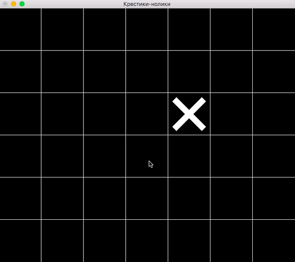

# demo-tic-tac-toe

Игра «Крестики-нолики» на поле N×M.



## Сборка и запуск

Клонируйте репозиторий:

```
git clone https://github.com/cmc-haskell-2017/demo-tic-tac-toe.git
cd demo-tic-tac-toe
```

Соберите проект при помощи [утилиты Stack](https://www.haskellstack.org):

```
stack setup
stack build
```

Собрать проект и запустить игру можно при помощи команды

```
stack build && stack exec demo-tic-tac-toe
```

## Задание

В качестве задания к [лекции «Функции над списками»](https://youtu.be/AwiOOkzZB_o) требуется
реализовать [функцию `estimate`](https://github.com/cmc-haskell-2017/demo-tic-tac-toe/blob/master/src/TicTacToe.hs#L196-L200).

Как только вы реализуете эту функцию, цвет фишек проигрывающего игрока (по версии `estimate`) будет затемняться.
